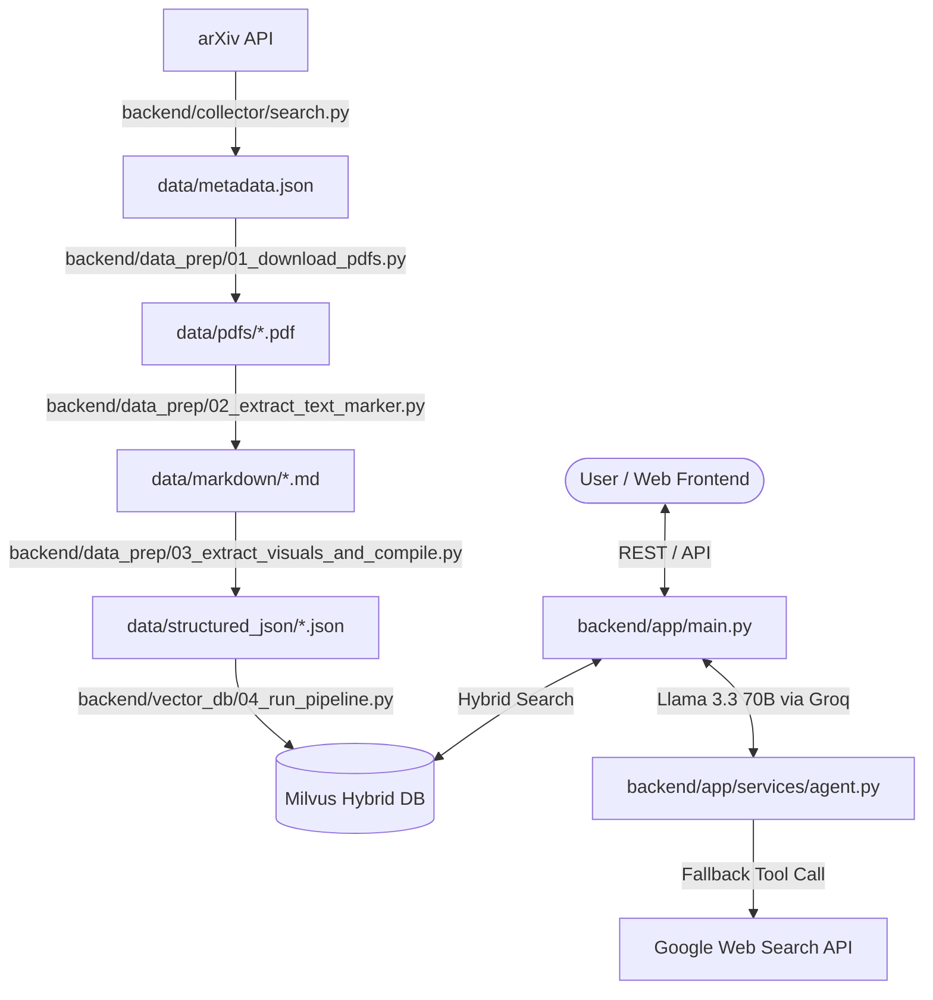

Here is a directory-by-directory review of the **AI Research Assistant (ArXivistAI)** codebase built so far:

---

### 📁 1. `backend/collector/` — arXiv Data Harvesting Pipeline
**Purpose**: Manages automated searching, filtering, metadata aggregation, and PDF fetching from arXiv.

- **[search.py](file:///d:/AI%20Research%20Assistant/backend/collector/search.py)**: Queries the arXiv API month-by-month and year-by-year across target categories (`cs.AI`, `cs.CL`, etc.). Deduplicates incoming papers against existing metadata records and periodically flushes state to disk.
- **[filters.py](file:///d:/AI%20Research%20Assistant/backend/collector/filters.py)**: Applies validation rules to enforce paper inclusion criteria (page count constraints, primary paper categories, language verification, etc.).
- **[downloader.py](file:///d:/AI%20Research%20Assistant/backend/collector/downloader.py)**: Batch-downloads PDF documents for validated arXiv paper IDs into the `data/pdfs/` storage directory.
- **[metadata.py](file:///d:/AI%20Research%20Assistant/backend/collector/metadata.py)**: Manages atomic loading, updating, and saving of the master paper registry `data/metadata.json`.
- **[config.yaml](file:///d:/AI%20Research%20Assistant/backend/collector/config.yaml)**: Central configuration file for target paper categories, target collection years (e.g., 2022–present), yearly quotas, and storage paths.

---

### 📁 2. `backend/data_prep/` — PDF Document Parsing & Extraction
**Purpose**: Multi-stage ingestion pipeline converting raw PDFs into clean, structured Markdown, figures, and JSON documents.

- **[01_download_pdfs.py](file:///d:/AI%20Research%20Assistant/backend/data_prep/01_download_pdfs.py)**: Orchestrates batch PDF downloads for papers present in metadata that lack local PDF files.
- **[02_extract_text_marker.py](file:///d:/AI%20Research%20Assistant/backend/data_prep/02_extract_text_marker.py)**: Executes the **Marker** deep learning PDF parser (`marker_single`) to convert PDF layouts into high-fidelity Markdown documents saved under `data/markdown/`.
- **[03_extract_visuals_and_compile.py](file:///d:/AI%20Research%20Assistant/backend/data_prep/03_extract_visuals_and_compile.py)**: Extracts figures, charts, and table images from PDFs into `data/extracted_images/`, links image tags inside Markdown, and outputs final compiled documents to `data/structured_json/`.

---

### 📁 3. `backend/vector_db/` — Vector Database & Embeddings
**Purpose**: Handles document chunking, hybrid dense/sparse vector embedding generation (BGE-M3), and Milvus collection indexing.

- **[schema.py](file:///d:/AI%20Research%20Assistant/backend/vector_db/schema.py)**: Defines the Milvus collection schema with dual vector fields (`dense_vector` 1024-dim, `sparse_vector`), scalar metadata fields (`paper_id`, `title`, `authors`, `published_year`, `categories`, `contains_image`, `chunk_index`, `text`), and Hybrid Search indexes (`AUTOINDEX` & `SPARSE_INVERTED_INDEX`).
- **[connection.py](file:///d:/AI%20Research%20Assistant/backend/vector_db/connection.py)**: Initializes connection to the Milvus client and loads the **BAAI BGE-M3** hybrid embedding model via `BGEM3EmbeddingFunction`.
- **[chunking.py](file:///d:/AI%20Research%20Assistant/backend/vector_db/chunking.py)**: Hierarchical header-aware Markdown splitting and recursive character chunking with reference stripping and conclusion extraction.
- **[04_run_pipeline.py](file:///d:/AI%20Research%20Assistant/backend/vector_db/04_run_pipeline.py)**: Ingestion script that loads structured JSON documents, chunks content, computes hybrid dense + sparse BGE-M3 embeddings, and upserts records into Milvus.
- **[config.py](file:///d:/AI%20Research%20Assistant/backend/vector_db/config.py)**: Vector database connection URIs, collection names, and storage path configurations.
- **[review_records.py](file:///d:/AI%20Research%20Assistant/backend/vector_db/review_records.py)**: Diagnostic utility for querying and inspecting indexed vectors and metadata inside Milvus.

---

### 📁 4. `backend/app/` — FastAPI Server & RAG Services
**Purpose**: Core web backend API providing authentication, paper retrieval, RAG agent execution, and database persistence.

- **[main.py](file:///d:/AI%20Research%20Assistant/backend/app/main.py)**: Entry point for the FastAPI application. Configures CORS, mounts static directory `/api/pdfs`, registers auth/API routers, and runs database migrations.
- **[run.py](file:///d:/AI%20Research%20Assistant/backend/run.py)**: Helper launcher script for uvicorn web server execution.
- **`api/`**:
  - **[routes.py](file:///d:/AI%20Research%20Assistant/backend/app/api/routes.py)**: API endpoints for paper search, chat/query routing, PDF streaming, and vector status.
  - **[auth.py](file:///d:/AI%20Research%20Assistant/backend/app/api/auth.py)**: Auth router supporting user registration, login, JWT token verification, and session management.
- **`services/`**:
  - **[agent.py](file:///d:/AI%20Research%20Assistant/backend/app/services/agent.py)**: Dual-stage Agentic RAG engine powered by `llama-3.3-70b-versatile` (Groq API). Performs primary Milvus hybrid search first, and dynamically triggers Google web search (`search_online` tool call) if paper context is insufficient.
  - **[milvus_search.py](file:///d:/AI%20Research%20Assistant/backend/app/services/milvus_search.py)**: Executes hybrid dense/sparse retrieval with **RRFRanker** (Reciprocal Rank Fusion) on Milvus.
  - **[daily_sync.py](file:///d:/AI%20Research%20Assistant/backend/app/services/daily_sync.py)**: Background synchronization service for paper updates.
  - **[system_prompt.py](file:///d:/AI%20Research%20Assistant/backend/app/services/prompt/system_prompt.py)**: Prompt engineering instructions governing academic synthesis, citation formatting, and tool-use triggers.
- **`core/` & `db/`**:
  - **[config.py](file:///d:/AI%20Research%20Assistant/backend/app/core/config.py)** & **[security.py](file:///d:/AI%20Research%20Assistant/backend/app/core/security.py)**: Environment configuration, bcrypt password hashing, and JWT creation/verification.
  - **[database.py](file:///d:/AI%20Research%20Assistant/backend/app/db/database.py)** & **[models.py](file:///d:/AI%20Research%20Assistant/backend/app/db/models.py)**: SQLite database connection using SQLAlchemy and user table models.

---

### 📁 5. `frontend/` — Single-Page React Web Application
**Purpose**: Modern, responsive user interface built with React, Vite, TypeScript, and TailwindCSS / Shadcn UI components.

- **[App.tsx](file:///d:/AI%20Research%20Assistant/frontend/src/app/App.tsx)**: Main application container housing tabbed features:
  1. **AI Chat Assistant**: Live interaction with the RAG agent, showing sources, citations, and web fallback indicators.
  2. **Paper Explorer & Search**: Browse, filter, and inspect collected arXiv papers.
  3. **PDF Viewer**: Embedded reader for reading parsed research PDFs directly.
  4. **Vector DB Manager**: Visual representation of indexed chunks and Milvus statistics.
  5. **Auth Modal**: Login and user registration interface.
- **[Guidelines.md](file:///d:/AI%20Research%20Assistant/frontend/guidelines/Guidelines.md)**: Design guidelines, theme tokens, and component specifications.

---

### 📁 6. `data/` — Storage & Artifact Directory
**Purpose**: Master repository containing local data files and intermediate build outputs.

- **`metadata.json`**: Complete JSON database of fetched arXiv papers and attributes.
- **`pdfs/`**: Raw PDF file store.
- **`markdown/`**: Marker-generated Markdown files per paper ID.
- **`structured_json/`**: Cleaned JSON files containing structured text and embedded figure references.
- **`extracted_images/`**: Figure diagrams, equations, and table images extracted from PDFs.
- **`failed_stage2.txt`**: Processing log tracking any failed extraction runs.

---

### 🔄 Overall System Architecture Workflow

